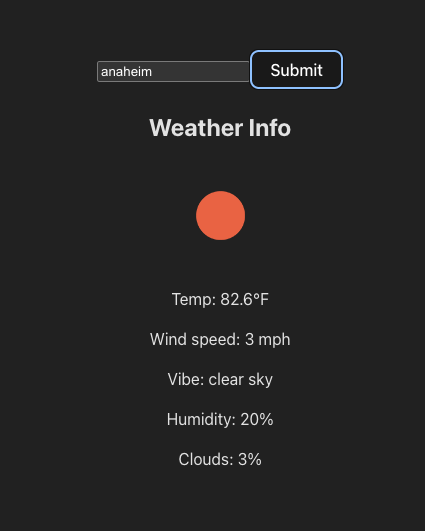

# Weather App

A full-stack weather application that displays current weather information for any city using the OpenWeatherMap API.

## Features
- Search weather by city name
- Displays temperature, wind speed, humidity, cloud coverage, and weather description
- Weather condition icons
- Real-time data from OpenWeatherMap API

## Technologies Used
- **Frontend:** React (Vite)
- **Backend:** Express.js, Node.js
- **API:** OpenWeatherMap API

## Setup Instructions

### Prerequisites
- Node.js installed
- OpenWeatherMap API key

### Installation

1. Clone this repository
```
   git clone https://github.com/adrianguzman301/weather-app.git
   cd weather-app
```

2. Install backend dependencies:
```
   cd server
   npm install
```

3. Install frontend dependencies:
```
   cd vite-weather-app
   npm install
```

4. Create a `.env` file in the server folder and add your API key:
```
   API_KEY=your_api_key_here
```

5. Start the backend server:
```
   cd server
   node server.js
```

6. Start the frontend (in a new terminal):
```
   cd vite-weather-app
   npm run dev
```

7. Open your browser to `http://localhost:5173`

## Usage
1. Enter a city name in the input field
2. Click Submit
3. View the current weather information

## Screenshot
  

# Nice-to-have/secondary or stretch goals

1. Error handling if user inputs an invalid city
2. Responsive design
3. Weather beyond cities, like ocean temp, various plants temp, etc.

